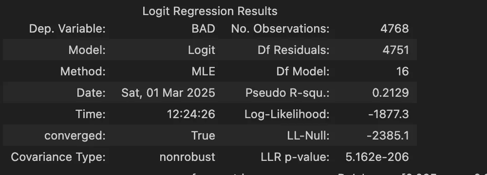
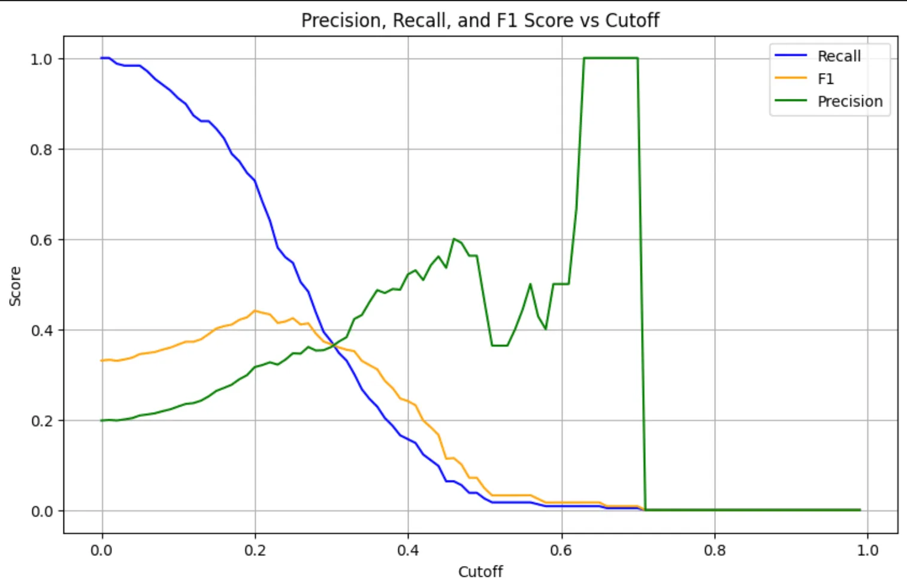

## 🎯 Project Overview

**Project Name**: Logistic Regression Loan Assessment

**Objective**: Develop a Logistic Regression model to predict whether a mortgage loan will **default** (BAD = 1) or be **likely to repay** (BAD = 0) based on historical data of 5,960 loans from a bank.

**Dataset**: The hmeq.csv dataset contains information on mortgage loans with 13 feature columns.

**Tools Used**: Python, Pandas, Scikit-learn, Statsmodels, Matplotlib, Seaborn.

**Key Results**: The model achieved a **Pseudo R-squared of 0.2129**, with key predictors including DELINQ, DEROG, and DEBTINC.


## Dataset Description

The dataset consists of **5,960 records** of mortgage loans, where each record represents a loan with the following features:

| **Column** | **Description** | **Data Type** |
| --- | --- | --- |
| BAD | 1 = Loan is delinquent or defaulted; 0 = Loan is performing or paid off | int64 |
| LOAN | Requested loan amount | int64 |
| MORTDUE | Outstanding balance of the existing mortgage | float64 |
| VALUE | Current property value | float64 |
| REASON | DebtCon = debt consolidation; HomeImp = home improvement | object |
| JOB | Borrower’s occupation | object |
| YOJ | Years of experience in the current job | float64 |
| DEROG | Number of derogatory reports (negative credit events) | float64 |
| DELINQ | Number of overdue credit loans | float64 |
| CLAGE | Age of the oldest credit loan in months | float64 |
| NINQ | Number of recent credit inquiries | float64 |
| CLNO | Number of current credit loans | float64 |
| DEBTINC | Debt-to-income ratio | float64 |

**Target**: Predict the BAD column based on the remaining features.


## Exploratory Data Analysis (EDA)

### 1. Data Size

- **Number of Records**: 5,960
- **Number of Columns**: 13
- Output from df.shape: (5960, 13)

### 2. Missing Values

The dataset has **11 out of 13 columns with missing values**, with the following missing rates:

```python
df.isna().sum()/df.shape[0]
```

| **Column** | **Missing Rate** |
| --- | --- |
| MORTDUE | 8.69% |
| VALUE | 1.88% |
| REASON | 4.23% |
| JOB | 4.68% |
| YOJ | 8.64% |
| DEROG | 11.88% |
| DELINQ | 9.73% |
| CLAGE | 5.17% |
| NINQ | 8.56% |
| CLNO | 3.72% |
| DEBTINC | 21.26% |

**Observations**:

- The DEBTINC column has the highest missing rate (21.26%), while BAD and LOAN have no missing values.
- Decision: Use **imputation** to handle missing values (mean for numerical columns, mode for categorical columns).

### 3. Descriptive Statistics

```python
df.describe()
```

| **Column** | **Mean** | **Std** | **Min** | **25%** | **50%** | **75%** | **Max** |
| --- | --- | --- | --- | --- | --- | --- | --- |
| BAD | 0.199 | 0.400 | 0 | 0 | 0 | 0 | 1 |
| LOAN | 18,607 | 11,207 | 1,100 | 11,100 | 16,300 | 23,300 | 89,900 |
| MORTDUE | 73,760 | 44,457 | 2,063 | 46,276 | 65,019 | 91,488 | 399,550 |
| VALUE | 101,776 | 57,385 | 8,000 | 66,075 | 89,235 | 119,824 | 855,909 |
| YOJ | 8.92 | 7.57 | 0 | 3 | 7 | 13 | 41 |
| DEROG | 0.25 | 0.85 | 0 | 0 | 0 | 0 | 10 |
| DELINQ | 0.45 | 1.13 | 0 | 0 | 0 | 0 | 15 |
| CLAGE | 179.77 | 85.81 | 0 | 115.12 | 173.47 | 231.56 | 1,168.23 |
| NINQ | 1.19 | 1.73 | 0 | 0 | 1 | 2 | 17 |
| CLNO | 21.30 | 10.14 | 0 | 15 | 20 | 26 | 71 |
| DEBTINC | 33.78 | 8.60 | 0.52 | 29.14 | 34.82 | 39.00 | 203.31 |

**Observations**:

- BAD: Approximately 19.95% of loans defaulted (mean = 0.199).
- LOAN and VALUE show high variability (large std), indicating diversity in loan amounts and property values.
- DEROG and DELINQ are mostly 0 (75% quantile = 0), but have some large outliers (max = 10 and 15).

### 4. Target Variable Analysis

- BAD = 0 (likely to repay): 80.05%
- BAD = 1 (default): 19.95%
- The dataset is slightly imbalanced, which should be considered during model evaluation.


## Feature Engineering

### 1. Train/Validation Split

- **Split Ratio**: 80% training, 20% validation with random_state=100.

```python
X_train,X_val,y_train,y_val = train_test_split(df.drop(columns=['BAD']),df['BAD'],test_size=0.2,random_state = 100,shuffle=True)
```

### 2. Handling Missing Values

- **Numerical Columns**: Imputed with the mean from the training set.
- **Categorical Columns**: Imputed with the mode from the training set.

python

CollapseWrapCopy

```python
for col in cat_cols:
  X_train[col] = X_train[col].fillna(X_train[col].mode()[0])
  X_val[col] = X_val[col].fillna(X_train[col].mode()[0])
for col in num_cols:
  X_train[col] = X_train[col].fillna(X_train[col].mean())
  X_val[col] = X_val[col].fillna(X_train[col].mean())
```

### 3. Encoding Categorical Variables

- Applied **One-Hot Encoding** to REASON and JOB columns, with drop_first=True to avoid multicollinearity.

```python
X_train = pd.get_dummies(X_train,columns=cat_cols,drop_first=True)
X_val = pd.get_dummies(X_val,columns=cat_cols,drop_first=True)
```


## Modeling

### 1. Logistic Regression Model

- Trained using the statsmodels library with processed features.

```python
X_train = sm.add_constant(X_train)
log_reg = sm.Logit(y_train, X_train).fit()
```

### 2. Model Results



| **Variable** | **Coefficient (coef)** | **P-value** | **Interpretation** |
| --- | --- | --- | --- |
| const | -2.5410 | 0.000 | Intercept |
| LOAN | -2.135e-05 | 0.000 | Slight negative impact |
| MORTDUE | -4.011e-06 | 0.010 | Slight negative impact |
| VALUE | 4.355e-06 | 0.000 | Slight positive impact |
| YOJ | -0.0164 | 0.011 | Negative impact |
| DEROG | 0.5523 | 0.000 | Strong positive impact |
| DELINQ | 0.7550 | 0.000 | Very strong positive impact |
| CLAGE | -0.0052 | 0.000 | Negative impact |
| NINQ | 0.1691 | 0.000 | Positive impact |
| CLNO | -0.0136 | 0.005 | Slight negative impact |
| DEBTINC | 0.0518 | 0.000 | Positive impact |
| REASON_HomeImp | 0.2246 | 0.016 | Positive impact |
| JOB_Office | -0.5561 | 0.001 | Negative impact |
| JOB_Sales | 1.0797 | 0.000 | Strong positive impact |

**Observations**:

- DELINQ (overdue loans), DEROG (derogatory reports), and DEBTINC (debt-to-income ratio) have the strongest positive impact on default probability.
- The Sales occupation increases default risk, while Office reduces it.


## Evaluation

- **Metrics**: Precision, Recall, and F1 Score were evaluated across different cutoff thresholds



**Observations**:

- The model requires a trade-off between Precision and Recall, depending on business priorities (e.g., minimizing default risk vs. maximizing loan approvals).

---

## Conclusion

- The Logistic Regression model provides reasonable predictive performance with a **Pseudo R-squared of 0.2129**.
- Key drivers of default include poor credit history (DELINQ, DEROG) and high debt-to-income ratio (DEBTINC).
- Limitations: The dataset is slightly imbalanced, and high missing rates in some columns (e.g., DEBTINC) may impact performance.
- Future Improvements: Experiment with other models (e.g., Random Forest, XGBoost) or apply oversampling techniques (e.g., SMOTE) to address class imbalance.
